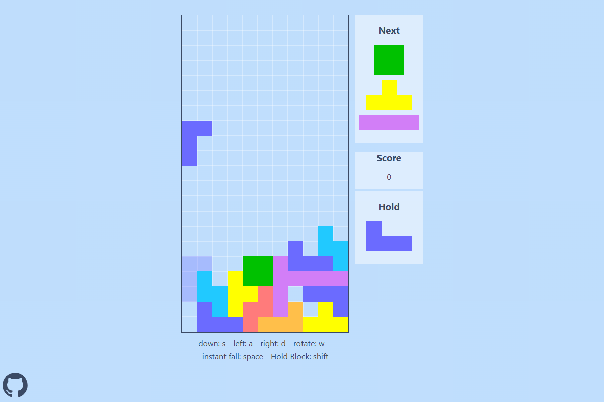

# Tetris Game using native Javascript

## Introduction

Hello! I'm Beltagy, and this project was truly exciting to build.

## What's New in this Project

Although I don't have much knowledge about game development, creating games from scratch was an incredibly enjoyable experience.

- This was my first time writing around 1500 lines of JavaScript.
  Admittedly, some of them are comments and repeated code, such as the rotation function for each block.
  Nevertheless, 1500 lines is quite an accomplishment for me.

## What I Learned from this Project

I believe that writing 1500 lines of JavaScript code as a beginner can be immensely beneficial for learning new concepts. Here are some of the things I learned:

- Creating a grid to store the position of each cell and synchronizing it with the DOM asynchronously.
- Extracting the width unit from CSS to facilitate responsive design based on breakpoints.
  I am aware that using canvas would have made it easier, but I haven't learned it yet.
- Gained experience in creating proper class structures for the first time and utilizing inheritance.
- Managing long code like this emphasizes the importance of keeping it DRY (Don't Repeat Yourself).

### Finally, I created this game to further improve my programming skills beyond the usual front-end development tasks.

While my goal wasn't to achieve perfection, working on this project was a fun and rewarding experience.

## Links

- [Live Site](https://mohammed-beltagy.github.io/Tetris_Game/) - Engage with the interactive features of this website and experience its full functionality.
- [Portfolio](https://beltagy.netlify.app) - Discover impressive projects with seamless functionality, and meticulous attention to detail.
